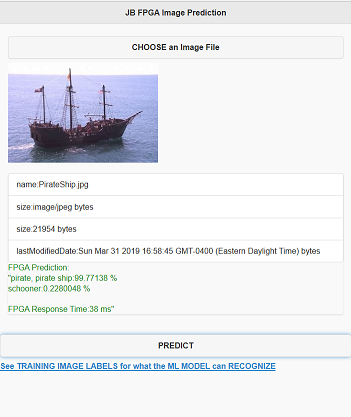

# Fun with FPGAs!

This working example seeks to extend the previous work that is referenced below to develop & deploy a Machine Learning Model (using a Databricks Python Notebook) to an Azure AKS Cluster that has specifically been provisioned with FPGA enabled Azure Virtual Machines (Standard PBS Family vCPU).  

This implementation seeks to take it a step further by enhancing the initial FPGA-Enabled Web Service
by adding a JQuery Mobile enabled Web client. The client can then be used to further test the ML Web Service by allowing the user to:
  * Visually select images (from any desktop or mobile device).
  * Submit the image to the ML web Service hosted on a FPGA-enabled AKS Cluster.
  * Receive up to (5) predictions (ordered by probability).
  * Prediction timing data for the FPGA Web Service Call. 

This repo contains extensions to previous work from these sources:  

 * Microsoft Azure Machine Learning Hardware Accelerated Models Powered by Project Brainwave
  https://github.com/Azure/aml-real-time-ai

 * Deploy a model as a web service on an FPGA with Azure Machine Learning service
  https://docs.microsoft.com/en-us/azure/machine-learning/service/how-to-deploy-fpga-web-service

Below is a high-level overview of the Architecture and the (2) basic steps to create this solution:

