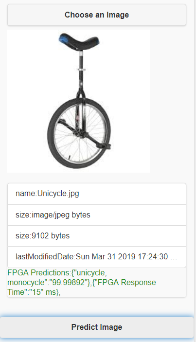
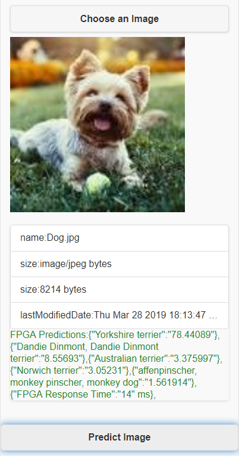
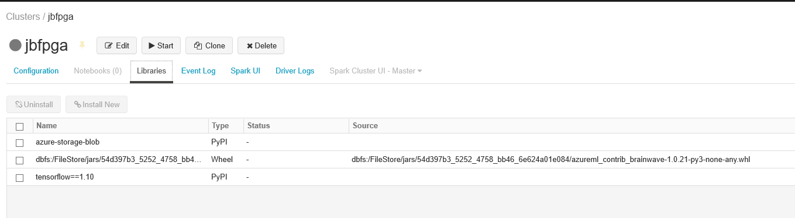

# Azure-FPGA-Mobile-Web-Client
Azure-FPGA-Mobile-Web-Client
This repo is based upon previous work from https://github.com/azure/aml-real-time-ai and seeks to provide a single, comprehensive working example of an FPGA Image Prediction front-end client and  working back-end application. 

The client application consists of a JQueryMobile front-end combined with a Web API back-end implemented in C# .NET 2.2 Core Web API.
The API handles the call to the Azure FPGA service via a Grpc calls that handle the FPGA interations to submit, time, and return the prediction results. 

Below  is a demo link and screenshot of the application in action. The application will return the top predictions with associated confidence levels along with the elapsed FPGA execution time in milliseconds.   If a single prediction has less than a 90% confidence level, then the top (5) predictions are returned. 

 
____________________________________



Demo URL: http://jbfpga-image-predict.azurewebsites.net/default.html

Note that when this application runs on a mobile phone, you can use the camera to take a photo and then upload it to get a real-time prediction.
Pretty impressive - especially when you realize that the image library is made-up of *only* @1000 images... It is very interesting to see the predictions provided for random items you can snap with your mobile phone!

What is also impressive is the response time for known items.  Repeated searches are also very fast due to caching. 

A text-based list of all the @1000 images can be found at: https://raw.githubusercontent.com/Lasagne/Recipes/master/examples/resnet50/imagenet_classes.txt

Here's a *partial* list of the images in the Resnet50 Model hosted in the Azure FPGA service:
```  
    tench, Tinca tinca
    goldfish, Carassius auratus
    great white shark, white shark, man-eater, man-eating shark, Carcharodon carcharias
    tiger shark, Galeocerdo cuvieri
    hammerhead, hammerhead shark
    electric ray, crampfish, numbfish, torpedo
    stingray
    cock
    hen
    ostrich, Struthio camelus
    brambling, Fringilla montifringilla
    goldfinch, Carduelis carduelis
    house finch, linnet, Carpodacus mexicanus
    junco, snowbird
    indigo bunting, indigo finch, indigo bird, Passerina cyanea
    robin, American robin, Turdus migratorius
    bulbul
    jay
    magpie
    chickadee
    water ouzel, dipper
    kite
    bald eagle, American eagle, Haliaeetus leucocephalus
    vulture
    great grey owl, great gray owl, Strix nebulosa
    European fire salamander, Salamandra salamandra
    common newt, Triturus vulgaris
    eft
    spotted salamander, Ambystoma maculatum
    axolotl, mud puppy, Ambystoma mexicanum
    bullfrog, Rana catesbeiana
    tree frog, tree-frog
    tailed frog, bell toad, ribbed toad, tailed toad, Ascaphus trui
    loggerhead, loggerhead turtle, Caretta caretta
    leatherback turtle, leatherback, leathery turtle, Dermochelys coriacea
    mud turtle
    terrapin
    box turtle, box tortoise
    banded gecko
    common iguana, iguana, Iguana iguana
    American chameleon, anole, Anolis carolinensis
    whiptail, whiptail lizard
    agama
    frilled lizard, Chlamydosaurus kingi
    alligator lizard
    Gila monster, Heloderma suspectum
    green lizard, Lacerta viridis
    African chameleon, Chamaeleo chamaeleon
    Komodo dragon, Komodo lizard, dragon lizard, giant lizard, Varanus komodoensis
    African crocodile, Nile crocodile, Crocodylus niloticus
    American alligator, Alligator mississipiensis
    triceratops
    thunder snake, worm snake, Carphophis amoenus
    ringneck snake, ring-necked snake, ring snake
    hognose snake, puff adder, sand viper
    green snake, grass snake
    king snake, kingsnake
    garter snake, grass snake
    water snake
    vine snake
    night snake, Hypsiglena torquata
    boa constrictor, Constrictor constrictor
    rock python, rock snake, Python sebae
    Indian cobra, Naja naja
    green mamba
    sea snake
    horned viper, cerastes, sand viper, horned asp, Cerastes cornutus
    diamondback, diamondback rattlesnake, Crotalus adamanteus
    sidewinder, horned rattlesnake, Crotalus cerastes
    trilobite
    harvestman, daddy longlegs, Phalangium opilio
    scorpion
    black and gold garden spider, Argiope aurantia
    barn spider, Araneus cavaticus
    garden spider, Aranea diademata
    black widow, Latrodectus mactans
    tarantula
    wolf spider, hunting spider
    tick
    centipede
    black grouse
    ptarmigan
    ruffed grouse, partridge, Bonasa umbellus
    prairie chicken, prairie grouse, prairie fowl
    peacock
    quail
    partridge
    African grey, African gray, Psittacus erithacus
    macaw
    sulphur-crested cockatoo, Kakatoe galerita, Cacatua galerita
    lorikeet
    coucal
    bee eater
    hornbill
    hummingbird
    jacamar
    toucan
    drake
    red-breasted merganser, Mergus serrator
    goose
    black swan, Cygnus atratus
    tusker
    echidna, spiny anteater, anteater
    platypus, duckbill, duckbilled platypus, duck-billed platypus, Ornithorhynchus anatinus
    wallaby, brush kangaroo
    koala, koala bear, kangaroo bear, native bear, Phascolarctos cinereus
    wombat
    jellyfish
    sea anemone, anemone
    brain coral
    flatworm, platyhelminth
    nematode, nematode worm, roundworm
    conch
    snail
    slug
    sea slug, nudibranch
```

The FPGA application Image Prediction service can be generated via the following Python Jupyter notebook:
[jbfpga_1_GitHub.ipynb](https://github.com/jbarnes1/Azure-FPGA-Mobile-Web-Client/blob/master/jbfpga_1_GitHub.ipynb)


This Python notebook is based upon the Github artifact below:

[Azure ML Hardware Accelerated Models Quickstart](https://github.com/Azure/aml-real-time-ai/blob/master/notebooks/project-brainwave-quickstart.ipynb)


This notebook is meant to be run on an Azure Databricks Cluster with the following libraries installed:



