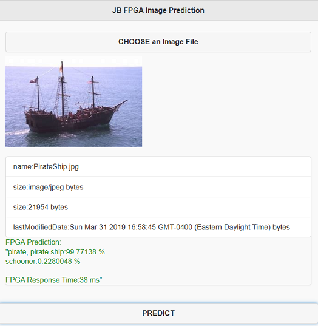
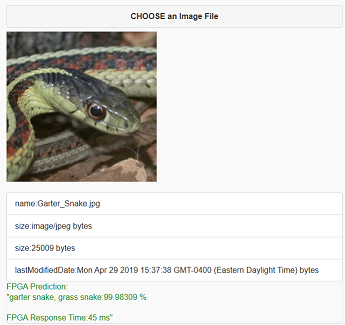
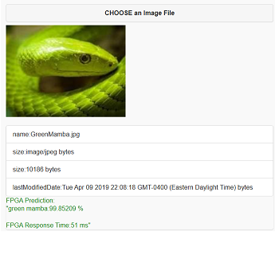

# Fun with FPGAs!

This working example seeks to extend the previous work that is referenced below to develop & deploy a Machine Learning Model (using a Databricks Python Notebook) to an Azure AKS Cluster that has specifically been provisioned with FPGA enabled Azure Virtual Machines (Standard PBS Family vCPU).  

This implementation seeks to take it a step further by enhancing the initial FPGA-Enabled Web Service
by adding a JQuery Mobile enabled Web client. The client can then be used to further test the ML Web Service by allowing the user to:
  * Visually select images (from any desktop or mobile device).
  * Submit the image to the ML web Service hosted on a FPGA-enabled AKS Cluster.
  * Receive up to (5) predictions (ordered by probability).
  * Prediction timing data for the FPGA Web Service Call. 

This repo contains extensions to previous work from these sources:  

 * Microsoft Azure Machine Learning Hardware Accelerated Models Powered by Project Brainwave
   https://github.com/Azure/aml-real-time-ai

 * Deploy a model as a web service on an FPGA with Azure Machine Learning service
   https://docs.microsoft.com/en-us/azure/machine-learning/service/how-to-deploy-fpga-web-service

Note that the Machine Learning model that is deployed to the Azure FPGA-enabled AKS Cluster is based upon a set of (1000) images that have been previously usied to train the model. You can see a list of these images at the URL below:
 * https://raw.githubusercontent.com/Lasagne/Recipes/master/examples/resnet50/imagenet_classes.txt

Below is a high-level overview of the Architecture and the (2) basic steps to create this solution:

## Practical Uses
There are many commercial and consumer scenarios that can benefit from this type of fast image recognition/prediction capability.
For example, many people may not be able to distinguish between certain animal species, like poisonous snakes for example.
Below is an example of poisonous snake detection. 
 * On the left - an image of a Garter Snake - which is non-venomous and virtually harmless. 
 * On the right - an image of the Green Mamba - which is a highly venomous snake.

 

Using these exciting new Azure technologies like Machine Learning and FPGA, it is now possible to create applications that can rapidly predict image contents (in under a second) and then use that prediction to make (in this case) life-saving decisions.  

## To Get started

First, follow the link below to provision an AML environment.

  * Deploy a model as a web service on an FPGA with Azure Machine Learning service
   https://docs.microsoft.com/en-us/azure/machine-learning/service/how-to-deploy-fpga-web-service

Make sure you have the appropriate VM quota permisions to deploy an FPGA-Enabled AKS Cluster in your subscription.  You can request a quota increase using this form: 
  * [FPGA Quota Request Form:](https://forms.office.com/Pages/ResponsePage.aspx?id=v4j5cvGGr0GRqy180BHbR2nac9-PZhBDnNSV2ITz0LNUN0U5S0hXRkNITk85QURTWk9ZUUFUWkkyTC4u)

Next, use the PYTHON Notebook in this repo to develop/deploy an ML model to an FPGA-enabled AKS Cluster: 
  * [Python Notebook:](https://github.com/jbarnes1/Azure-FPGA-Mobile-Web-Client/blob/master/Notebooks/jbFPGA_Python_AML_Service_v5.ipynb)

Once you have a working model deployed and working with a test Python client (included in the Python Notebook above), you can then open the Visual Studio 2017 project in IMAGE_UPLOAD folder, and then build and deploy the project.  One of the keys to success is to make sure that the IP address of your Azure AKS Cluster is updated in the ASP.NEt application like below:

  

You can see a working demo at this URL: 
 * [Azure FPGA Demo:](https://jbfpga.azurewebsites.net/jbjqm.html)

ENJOY!

